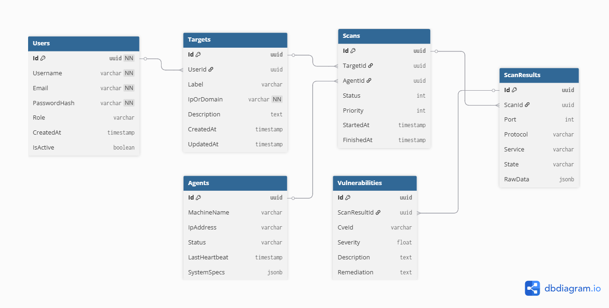

# 🛡️ Cyber Threat Intelligence Hub (CTI-Hub)

> **Modüler, Dağıtık ve Poliglot Mimariye Sahip Siber Güvenlik İstihbarat Platformu.**

## 🏗️ Proje Vizyonu
Bu proje, farklı programlama dillerinin en güçlü yanlarını kullanarak (C#, Go, Python, Java) geliştirilmiş; ölçeklenebilir bir zafiyet analiz ve yönetim sistemidir.

## 🚀 Mimari Tasarım
Proje **Clean Architecture** prensiplerine uygun olarak tasarlanmıştır.

*(Buraya docs klasöründeki resim gelecek)*

## 🛠️ Teknoloji Yığını
* **Core API:** ASP.NET Core 8 (.NET)
* **Scanner:** Go (Golang)
* **Analysis:** Python (Pandas & AI)
* **Agent:** Java
* **Database:** PostgreSQL
* **Infrastructure:** Docker & Docker Compose

## 🚧 Mevcut Durum
Şu an **Phase 1: Mimari Tasarım ve Veritabanı Modelleme** aşaması tamamlanmıştır. Geliştirme süreci devam etmektedir.